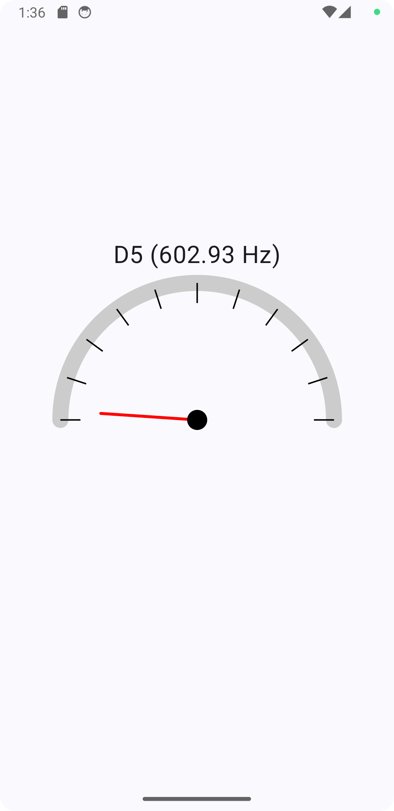

# Song Machinery Android

Just to learn how to develop an Android app using Kotlin and Jetpack Compose.

## Technologies

- DSP (FFT) to detect pitch from frequencies;
- Canvas to draw tuner;

Until now:

Not bad right? But I'm still working on it.
